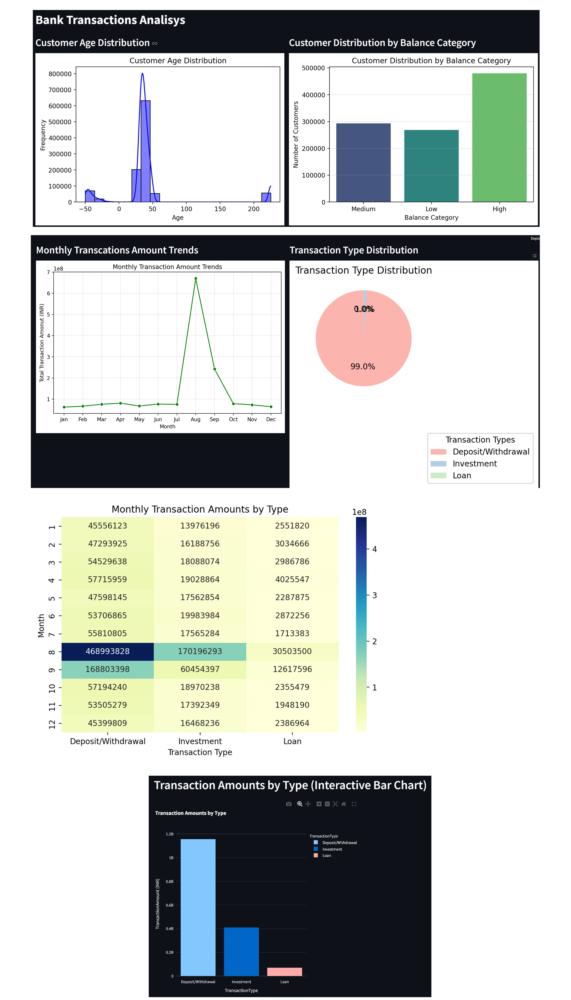

# Bank Transactions Analysis

This is a data analysis project using Python and Streamlit to explore and visualize bank transaction data.

## Features:
- Visualizes customer age distribution.
- Displays the distribution of customers by account balance category.
- Shows monthly transaction trends.
- Analyzes transaction types (Loan, Investment, Deposit/Withdrawal).
- Interactive charts for transaction amounts by type.

## Requirements:
- Python 3.x
- pandas
- matplotlib
- seaborn
- plotly
- streamlit

## How to Run:
1. Clone this repository to your local machine:
   ```bash
   git clone https://github.com/kdybkowski/bank-transactions-analysis.git
   ```
2. Install required dependencies:
   ```bash
   pip install -r requirements.txt
   ```
3. Run the Streamlit app:
   ```bash
   streamlit run bank_transactions_analysis.py
   ```

## Dataset
The dataset used for this project is stored in a compressed .zip file for efficient storage and to comply with file size constraints on GitHub.

File location: data/bank_transactions.csv.zip
Compression format: ZIP

How to Extract the Dataset

Before running the project, extract the dataset in the data/ folder!

## Screenshots:


## Dataset Source:
The dataset used in this project is sourced from Shivam Bansal, available at: [Dataset Link](https://www.kaggle.com/datasets/shivamb/bank-customer-segmentation)

## License:
This project is licensed under the MIT License.
